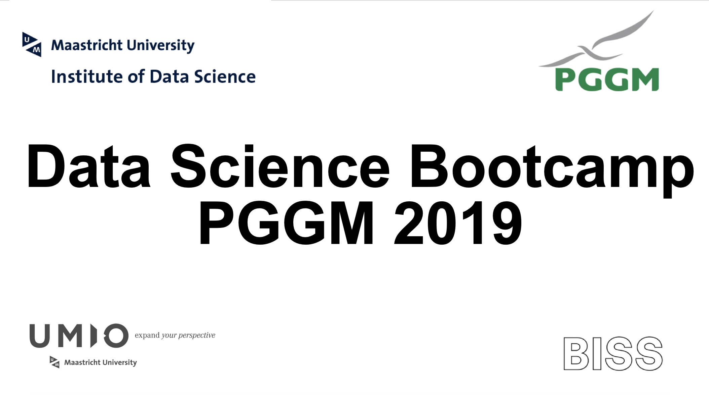

# PGGM Bootcamp

#### Work materials for the Data Science Bootcamp at PGGM

---
#### Materials
Module 1

[Notebook 3](http://bit.ly/bootcamp_notebook_3)  
[Notebook 2](http://bit.ly/bootcamp_notebook2)  
[Notebook 1](http://bit.ly/bootcamp_notebook1)  
[Assignment 3](http://bit.ly/bootcamp_ex3)  
[Assignment 2](http://bit.ly/bootcamp_ex2)  
[Assignment 1](http://bit.ly/bootcamp_ex1)  
[Book](http://bit.ly/2RJCXx3)  
[PGGM dummy data](http://bit.ly/PGGM_dataset)  
[Airbnb ams data](http://bit.ly/airbnb_ams_dataset)  

Module 2 

1. [Simple Linear Regression](https://github.com/MaastrichtU-IDS/data-science-bootcamp-pggm/blob/master/module2_notebooks/Supervised%20Regression/parametric/simple-linear-regression/main.ipynb)
2. [Multiple Linear Regression](https://github.com/MaastrichtU-IDS/data-science-bootcamp-pggm/blob/master/module2_notebooks/Supervised%20Regression/parametric/multiple-linear-regression/main.ipynb)
3. [Support Vector Machine Regression](https://github.com/MaastrichtU-IDS/data-science-bootcamp-pggm/blob/master/module2_notebooks/Supervised%20Regression/parametric/support-vector-regression/main.ipynb)
4. [Decision Trees Regression](https://github.com/MaastrichtU-IDS/data-science-bootcamp-pggm/blob/master/module2_notebooks/Supervised%20Regression/non-parametric/decision-tree/main.ipynb)
5. [K Nearest Neighbor Regression](https://github.com/MaastrichtU-IDS/data-science-bootcamp-pggm/blob/master/module2_notebooks/Supervised%20Regression/non-parametric/knn-regression/K%20Nearest%20Neighbors%20with%20Python.ipynb)
6. [Regression Evaluation Metrics](https://github.com/MaastrichtU-IDS/data-science-bootcamp-pggm/blob/master/module2_notebooks/Supervised%20Regression/Evaluation/regression-metrics-sklearn.ipynb)
7. [Cross Validation](https://github.com/MaastrichtU-IDS/data-science-bootcamp-pggm/blob/master/module2_notebooks/Supervised%20Regression/Evaluation/1.%20Cross%20Validation%20and%20its%20types.ipynb)
8. [Logistic Regression](https://github.com/MaastrichtU-IDS/data-science-bootcamp-pggm/blob/master/module2_notebooks/Supervised%20Classification/logistic-regression/Logistic_Regression.ipynb)
9. [Naive Bayesian](https://github.com/MaastrichtU-IDS/data-science-bootcamp-pggm/blob/master/module2_notebooks/Supervised%20Classification/naive-bayes/main.ipynb)
10. [Support Vector Machine Classification](https://github.com/MaastrichtU-IDS/data-science-bootcamp-pggm/blob/master/module2_notebooks/Supervised%20Classification/svm/main.ipynb)
11. [K Nearest Neighbor Classification](https://github.com/MaastrichtU-IDS/data-science-bootcamp-pggm/blob/master/module2_notebooks/Supervised%20Classification/k-nearest-neighbor/main.ipynb)
12. [Decision Tree Classification](https://github.com/MaastrichtU-IDS/data-science-bootcamp-pggm/blob/master/module2_notebooks/Supervised%20Classification/decision-tree/main.ipynb)
13. [Random Forest](https://github.com/MaastrichtU-IDS/data-science-bootcamp-pggm/blob/master/module2_notebooks/Supervised%20Classification/random-forest/main.ipynb)
14. [Classification Evaluation Metrics](https://github.com/MaastrichtU-IDS/data-science-bootcamp-pggm/blob/master/module2_notebooks/Supervised%20Classification/Evaluation/classification-metrics-sklearn.ipynb)
15. [Model Validation](https://github.com/MaastrichtU-IDS/data-science-bootcamp-pggm/blob/master/module2_notebooks/Supervised%20Classification/Evaluation/model_validation.ipynb)
16. [Grid Search and Randomized Search](https://github.com/MaastrichtU-IDS/data-science-bootcamp-pggm/blob/master/module2_notebooks/Supervised%20Classification/Evaluation/Grid%20Search%20and%20Randomized%20Search.ipynb)
17. [Model Evaluation](https://github.com/MaastrichtU-IDS/data-science-bootcamp-pggm/blob/master/module2_notebooks/Supervised%20Classification/Evaluation/model_evaluation.ipynb)
18. [K Means Clustering](https://github.com/MaastrichtU-IDS/data-science-bootcamp-pggm/blob/master/module2_notebooks/Unsupervised/k-means/main.ipynb)
19. [Hierarchical Clustering](https://github.com/MaastrichtU-IDS/data-science-bootcamp-pggm/blob/master/module2_notebooks/Unsupervised/hierarchical-clustering/main.ipynb)
20. [Principal Component Analysis](https://github.com/MaastrichtU-IDS/data-science-bootcamp-pggm/blob/master/module2_notebooks/Unsupervised/kernel-pca/k_pca.ipynb)
21. [Clustering Metrics](https://github.com/MaastrichtU-IDS/data-science-bootcamp-pggm/blob/master/module2_notebooks/Unsupervised/Evaluation/clustering-metrics-sklearn.ipynb)
22. [Silhouette Distance](https://github.com/MaastrichtU-IDS/data-science-bootcamp-pggm/blob/master/module2_notebooks/Unsupervised/Evaluation/Silhoutte%20Distance%20for%20Clustering.ipynb)
23. [Neural Network Introduction](https://github.com/MaastrichtU-IDS/data-science-bootcamp-pggm/blob/master/module2_notebooks/Unsupervised/Intro_to_NN.ipynb)

- [Custom Confusion Matrix Plot](https://github.com/MaastrichtU-IDS/data-science-bootcamp-pggm/blob/master/module2_notebooks/Supervised%20Classification/plot_confusion_matrix.ipynb)
- [Classifier Comparison Plot](https://github.com/MaastrichtU-IDS/data-science-bootcamp-pggm/blob/master/module2_notebooks/Supervised%20Classification/plot_classifier_comparison.ipynb)
- [Assignment Day 1](https://github.com/MaastrichtU-IDS/data-science-bootcamp-pggm/blob/master/module2_notebooks/Assignments/Day1.ipynb)
- [Solutions Day 1](https://github.com/MaastrichtU-IDS/data-science-bootcamp-pggm/blob/master/module2_notebooks/Assignments/Solution1.ipynb)

#### External sources
Module 1
- https://towardsdatascience.com/python-for-finance-stock-portfolio-analyses-6da4c3e61054  
- https://towardsdatascience.com/efficient-frontier-optimize-portfolio-with-scipy-57456428323e  
- http://wavedatalab.github.io/datawithpython/timeseries.html  
- https://github.com/kdboller/pythonsp500-plotly-dash  
- https://www.alphavantage.co/  
- https://www.worldtradingdata.com/  

Module 2
- https://scikit-learn.org/stable/user_guide.html
- https://www.oreilly.com/library/view/hands-on-machine-learning/9781491962282/
- http://shop.oreilly.com/product/0636920033400.do
- https://www.datacamp.com/courses/machine-learning-for-finance-in-python

Application
- https://www.capgemini.com/2018/07/how-wealth-managers-can-use-insights-from-ai-and-machine-learning/
- https://www.tcs.com/content/dam/tcs/pdf/Industries/Banking%20and%20Financial%20Services/analytics-artificial-intelligence-machine-learning-0817-1.pdf
- https://igniteoutsourcing.com/fintech/machine-learning-in-finance/
- https://emerj.com/ai-sector-overviews/machine-learning-in-investment-management-and-asset-management/

---

Disclaimer: The data sources and libraries are either open available or made up.
